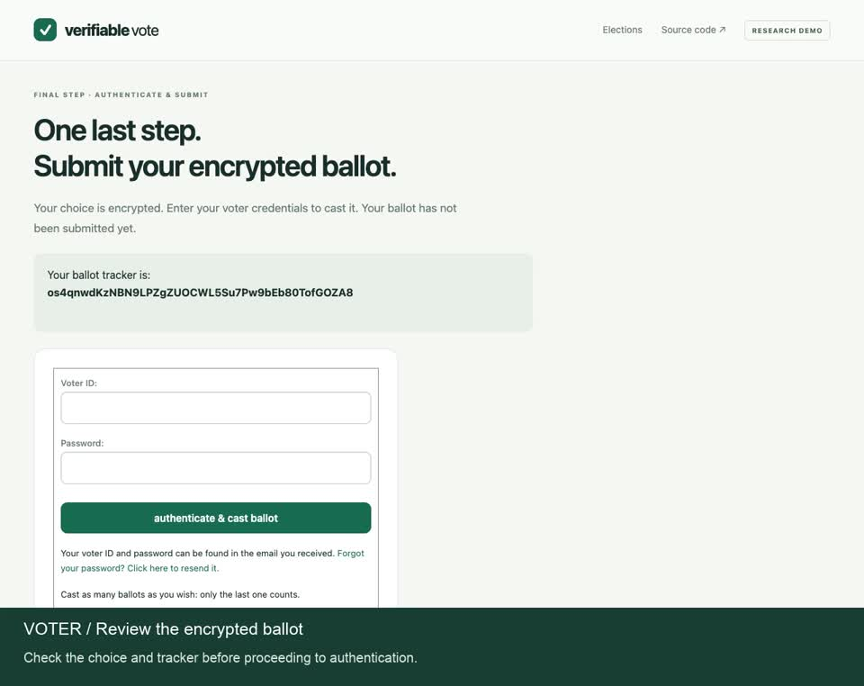

# Verifiable Vote

Open-source research prototype built around [Helios](https://github.com/benadida/helios-server), not a new election cryptosystem.

**Status: local synthetic demo. No government election certification, anonymity, receipt-freeness, or coercion-resistance claims.**

The first milestone evaluates an existing working voting application before building proven gaps. Helios supplies the administrator UI, password voter authentication, browser-encrypted ballots, trackers, revoting, and homomorphic tally. This repository adds a pinned startup recipe, a two-voter fixture, a public evidence export, offline verification orchestration, and focused integration tests. Upstream code is downloaded unchanged, not copied or reimplemented.

## Watch the demo

[](https://github.com/dishant411/verifiable-vote/blob/main/docs/demo/voter-and-admin-demo.mp4)

**[Watch or download the demo video](https://github.com/dishant411/verifiable-vote/raw/refs/heads/main/docs/demo/voter-and-admin-demo.mp4)** · 1 minute 57 seconds · Captioned, without audio.

The redesigned interface walkthrough shows the administrator reviewing the roster and opening the election, a voter encrypting and submitting a ballot and saving the receipt, then the administrator closing voting, computing the tally, and publishing the results. All accounts and votes are synthetic. The recording uses one Helios trustee and does not demonstrate offline verification.

## Quick start

Install [uv](https://docs.astral.sh/uv/getting-started/installation/) and Git. On Linux, install LDAP/SASL development libraries (`libldap2-dev libsasl2-dev`) before setup. A compiler and relevant headers may be required for upstream `python-ldap`. Tested on macOS arm64 with uv 0.12.22 and Python 3.13.16.

```sh
bash scripts/demo.sh setup && bash scripts/demo.sh serve
```

Open http://localhost:8000/helios/e/synthetic-demo-v2. The application binds only to loopback. Setup installs the exact upstream lockfile and Python version required by upstream. First setup needs Internet access; subsequent demo and verification runs use local dependencies.

- Voters: `alice` and `bob`; synthetic passwords are in `.runtime/credentials.json`. Never commit that file.
- Administrator: use the upstream **Dev Login**, then open the seeded election. This bypass is for local testing only.
- Select a choice in the existing booth, review, submit, authenticate, and retain the tracker.
- Revoting is allowed. Only each voter's latest valid ballot counts; a superseded tracker is not inclusion in the final tally.
- Administrator: compute encrypted tally, combine decryptions, then release results. The demo has one server-held trustee key, not independent distributed trust.
- Outbound email is disabled; the local in-memory email backend is used.

## Reproduce and verify evidence

```sh
bash scripts/demo.sh test
bash scripts/demo.sh sample
bash scripts/demo.sh verify "$PWD/evidence/sample-election.json"
# Export the manually completed election after releasing its result:
bash scripts/demo.sh export --short-name synthetic-demo-v2 --output "$PWD/.runtime/manual-election.json"
```

The synthetic sample casts three ballots (Alice votes Garden then revotes Library; Bob votes Garden), counts two, and publishes `[[1, 1]]`. The fixture deliberately uses upstream Python encryption for automation; the interactive booth encrypts in the browser.

The checked-in sample fingerprint is `QjqlYLzVq9+0TsharA/deAU9QeqGouIr6BCRc6xdP3M`. To bind verification to that specific record:

```sh
bash scripts/demo.sh verify "$PWD/evidence/sample-election.json" --expected-fingerprint QjqlYLzVq9+0TsharA/deAU9QeqGouIr6BCRc6xdP3M
```

Add `--tracker TRACKER` to check a counted ballot. Regenerated samples have fresh keys/randomness and a different fingerprint. Compare with a fingerprint independently obtained when the election opened. A fingerprint inside its own untrusted export establishes consistency, not authenticity.

The offline adapter checks ballot proofs and election binding, tracker hashes, unique counted aliases, the reconstructed encrypted aggregate, trustee key proof/combination, decryption proofs, and the published tally. It reuses upstream Python crypto APIs. It runs without database queries or network calls, but is **not a separately developed independent cryptographic implementation**. Scope: one question, two options, up to 100 counted ballots, one trustee. It cannot prove the authoritative roster, roster completeness, all cast/revoked/superseded ballots, or human eligibility from this export.

## What is established and what remains

| Goal | Current evidence | Limit |
| --- | --- | --- |
| Eligibility | Existing closed-roster password flow rejects an unknown login | Synthetic roster; no civil identity proofing |
| Duplicate prevention | Three valid submissions produce two counted ballots | Revoting policy; concurrent races not validated |
| Encrypted ballots | Browser booth plus upstream proof checks | Browser integrity and trustee secrecy remain trust assumptions |
| Inclusion tracker | Counted tracker check; superseded tracker rejected | Voters must compare the correct final record |
| Downloadable audit evidence | Checked-in JSON and local export command | No new public download UI; synthetic records only |
| Offline verification | No server access or DB queries required | Same upstream crypto implementation; no eligibility proof |
| Identity unlinkability | **Not established** | Upstream voter/ballot foreign keys and metadata remain |

See [ROADMAP](ROADMAP.md), [threat model](docs/THREAT_MODEL.md), [upstream assessment](docs/UPSTREAM_REVIEW.md), [validation](docs/VALIDATION.md), and [demo walkthrough](docs/DEMO.md).

This does not implement the handoff's custom three-service monorepo, mock anonymous credentials, passkeys, ElectionGuard layering, or civic portal. The latest direction prioritizes reuse. ElectionGuard is an alternative toolkit if Helios cannot meet a reviewed requirement. Decidim is a later civic participation option. Login.gov is a future partnership-dependent identity adapter; passkeys/Face ID unlock credentials locally and do not prove eligibility.
