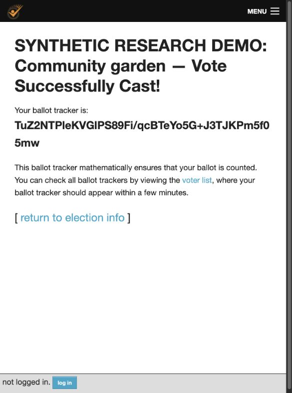

# Validation record

Performed 2026-10-02 on macOS arm64. Upstream revision `88621e3196961ec03fe54bbd3a1c2196e715e9a2`; Python 3.13.16, uv 0.12.22, frozen upstream lockfile. No upstream files were modified.

## Passed

- Fresh pinned upstream checkout, frozen dependency installation and all database migrations using the final `scripts/demo.sh setup` recipe.
- Six focused integration tests in the final checkout: **6 passed**, 3.638 seconds. Tests include HTTP password authentication (unknown voter rejected), actual upstream cast/verification/tracker route, post-tally cast closure, sequential revoting with two counted ballots from three submissions, superseded tracker rejection, nine evidence mutation cases, modified ciphertext with recomputed tracker rejected by crypto proofs, export private-field exclusion, and offline proof checks with zero database queries.
- Sample election: Garden 1, Library 1, counted ballots 2. Verified against independently specified checked-in sample fingerprint `QjqlYLzVq9+0TsharA/deAU9QeqGouIr6BCRc6xdP3M`.
- Browser check of the unmodified upstream UI: opened the synthetic election, selected Garden, browser-encrypted the ballot, reviewed it, authenticated as synthetic Alice, and reached **Vote Successfully Cast** with tracker `TuZ2NTPleKVGlPS89Fi/qcBTeYo5G+J3TJKPm5f05mw`. This manual run is separate from the checked-in automated sample.
- Shell startup script syntax validation.

The browser check found a missing `cast_url` in the first seed implementation. The corrected seed supplies a UUID and submission URL before freezing. A regression assertion now checks the public manifest URL. The final fixture uses fresh elections; frozen manifests were not silently amended.

## Broader upstream suite: incomplete

`bash scripts/demo.sh upstream-tests` uses upstream defaults with SQLite substituted. It discovered 214 tests, ran 184, and ended **FAILED (errors=5, skipped=1)**. Five fixture-backed test classes cannot load timezone-aware fixture dates into SQLite while upstream sets `USE_TZ=False`. This is a concrete backend incompatibility, not a passing full regression suite. No upstream test or fixture was edited to conceal it. Run the original suite against upstream's PostgreSQL 16 CI configuration next.

The local Docker CLI exists but no Docker engine/socket was running. The demo therefore uses SQLite and synchronous Celery tasks. PostgreSQL, RabbitMQ, asynchronous task ordering, race-condition safety and production configuration were not validated.

## Not established

Complete browser tally ceremony E2E automation, cryptographic implementation independence, real human eligibility, authenticated roster completeness, anonymity/unlinkability, receipt-freeness/coercion resistance, dependency vulnerability scan/SBOM, multi-trustee distribution, key recovery, production accessibility, public hosting, or public-election certification.

The CI workflow reproduces setup, six tests and sample verification on Linux. A local pass is not a claim that a remote CI run succeeded; inspect GitHub Actions for that result.
